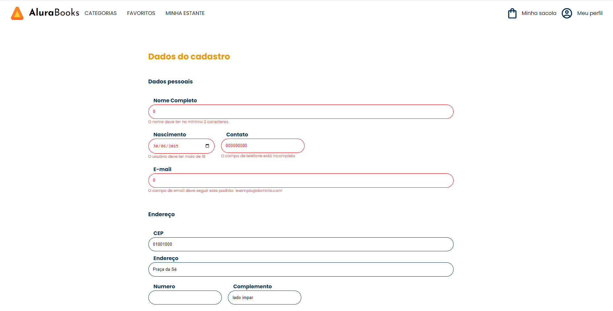
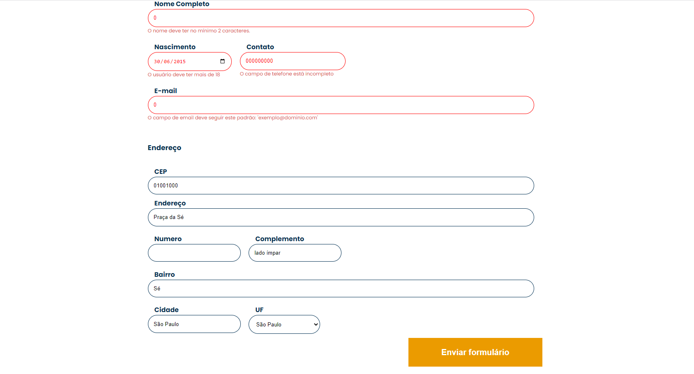

# Alura books - Formulário

This project was generated with [Angular CLI](https://github.com/angular/angular-cli) version 13.2.5.

Este projeto foi desenvolvido durante o curso da Alura
 https://cursos.alura.com.br/formacao-angular-14. 
 
## Índice

- [Visão geral](#visão-geral)
  - [O projeto](#o-projeto)
  - [Screenshot](#screenshot)
- [Processo de desenvolvimento](#desenvolvimento-processo)
  - [Construído com](#construído-com)
- [Codificado por](#coded-by)

## Visão geral

### O projeto

- Validação dos campos 
- Autocomplete de endereço através do CEP. 

### Captura de tela

## Processo de desenvolvimento

### Construído com

- Angular 

## Codificado por

- LinkedIn - [@karolinequetz](https://www.linkedin.com/in/karolinequetz)
